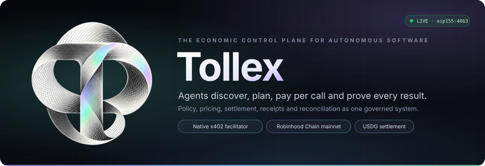
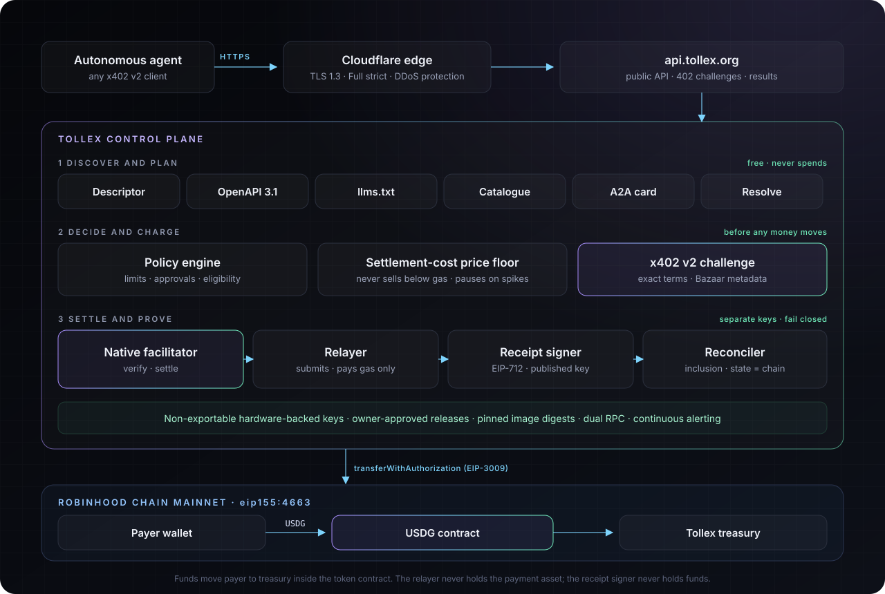
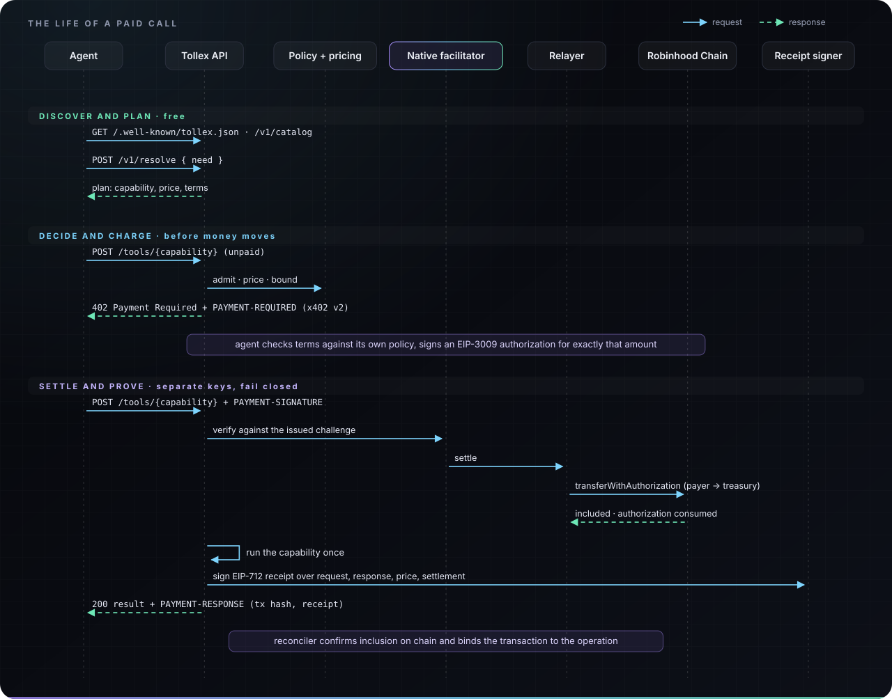
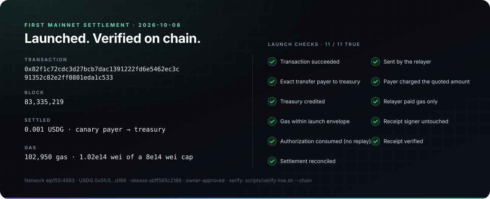

<p align="center">
  <a href="https://api.tollex.org/.well-known/tollex.json">
    
  </a>
</p>

<p align="center">
  <a href="https://api.tollex.org/ready"></a>
  <a href="https://api.tollex.org/v1/catalog"></a>
  <a href="docs/X402.md"></a>
  <a href="docs/MAINNET_LAUNCH.md"></a>
</p>

<p align="center">
  <a href="#what-tollex-is"><b>Overview</b></a> ·
  <a href="#architecture"><b>Architecture</b></a> ·
  <a href="#the-life-of-a-paid-call"><b>Paid call</b></a> ·
  <a href="#try-it-in-60-seconds"><b>Try it</b></a> ·
  <a href="#proof-of-production"><b>Proof</b></a> ·
  <a href="docs/"><b>Documentation</b></a> ·
  <a href="SECURITY.md"><b>Security</b></a>
</p>

<br>

## What Tollex is

Software agents can already read the web and call APIs. What they cannot do safely is **transact**: buy
a capability from a service they have never seen, within a budget they cannot exceed, and walk away
with proof of exactly what they paid for and what they received.

**Tollex is the economic control plane that makes that possible.** It sits between autonomous software
and the capabilities it buys, and it governs every step of a paid call as one system:

| | Layer | What Tollex guarantees |
| :-: | --- | --- |
| **01** | **Discovery** | Agents find what is offered, its schema and its price, machine to machine, without a human in the loop. |
| **02** | **Planning** | A free resolve step chooses the right capability and states the cost before anything is spent. |
| **03** | **Policy** | Limits, approvals and eligibility are enforced **before** a payment is requested, not after. |
| **04** | **Pricing** | Every price covers its own on-chain settlement cost. If network gas spikes, Tollex pauses instead of selling at a loss. |
| **05** | **Settlement** | A native x402 facilitator verifies and settles USDG payments on Robinhood Chain itself, with no third-party settlement dependency. |
| **06** | **Receipts** | Every paid result carries an EIP-712 receipt that binds the request, the response, the price and the on-chain payment. |
| **07** | **Reconciliation** | Every settlement is confirmed on chain and matched to its operation. The chain, not a database, is the source of truth. |

The result is a service an agent can pay **per call, in a stable asset, with no account, no API key and
no custody**, and that its operator can audit end to end.

> [!NOTE]
> This repository is the official public home of Tollex: technical documentation, the record of the
> mainnet launch and tooling that lets anyone verify the live service independently. The Tollex
> implementation is proprietary and is not published here. See [NOTICE](NOTICE).

<br>

## At a glance

| Production | | Interfaces | |
| --- | --- | --- | --- |
| **Status** | Live since 2026-10-08 | **Discovery** | Descriptor, OpenAPI 3.1, `llms.txt`, catalogue |
| **Endpoint** | [`api.tollex.org`](https://api.tollex.org/.well-known/tollex.json) | **Agent-to-agent** | A2A agent card and JSON-RPC endpoint |
| **Network** | Robinhood Chain mainnet, `eip155:4663` | **Payment** | HTTP 402 challenges with Bazaar metadata |
| **Asset** | USDG, 6 decimals | **Proof** | EIP-712 receipts, published signing keys |
| **Protocol** | x402 v2, `exact`, EIP-3009 | **Status** | Readiness, operation and receipt lookups |
| **Capabilities** | 34 first-party, JSON Schemas | **Security** | [security@tollex.org](mailto:security@tollex.org) |

<br>

## What makes it different

<table>
<tr>
<td width="33%" valign="top">

#### Native facilitator
Tollex verifies and settles x402 payments with its own facilitator and relayer. Payment terms,
verification, settlement and reconciliation are governed by one policy rather than stitched across
vendors.

</td>
<td width="33%" valign="top">

#### Policy before payment
An agent's call is admitted, priced and bounded before it is asked to sign anything. A payment that
does not match the issued terms is refused before any work runs.

</td>
<td width="33%" valign="top">

#### Pricing that covers settlement
Prices track the live cost of settling on chain plus a margin. A price never changes after it has been
authorized, and new paid calls pause automatically when gas moves beyond tolerance.

</td>
</tr>
<tr>
<td valign="top">

#### Cryptographic receipts
Each result is signed with a published key over a canonical hash of the request, response, pricing
terms and settlement. Receipts can be verified offline by anyone.

</td>
<td valign="top">

#### No custody, ever
Payers sign an EIP-3009 authorization for an exact amount, to an exact recipient, usable once. Funds move
from payer to treasury inside the token contract; Tollex never holds a customer balance.

</td>
<td valign="top">

#### Fail closed by design
Signing keys are separated by duty and held in non-exportable hardware-backed storage. Contract drift,
RPC disagreement, low balances and spent gas budgets all stop the affected path automatically.

</td>
</tr>
</table>

<br>

## Architecture

<p align="center"></p>

Tollex is organised in three bands, each with its own responsibilities, keys and failure behaviour:

1. **Discover and plan** is entirely free. Agents read the descriptor, OpenAPI document, `llms.txt`,
   catalogue or A2A card, then ask the resolver which capability fits a task and what it costs.
2. **Decide and charge** happens before money moves. The policy engine admits or refuses the call,
   the price floor guarantees the price covers settlement, and the service issues an x402 v2 challenge
   with exact terms.
3. **Settle and prove** is where funds move. The facilitator verifies the signed authorization against
   the challenge it issued, the relayer submits it to Robinhood Chain, the capability runs exactly once,
   the receipt signer signs the result, and the reconciler confirms inclusion on chain.

Four on-chain identities keep duties apart: a **relayer** that only pays gas, a **receipt signer** that
never holds funds, a **treasury** that receives revenue and signs nothing in normal operation, and an
operator **canary payer** used only for controlled launch checks. Details: [ARCHITECTURE](docs/ARCHITECTURE.md),
[SECURITY_MODEL](docs/SECURITY_MODEL.md).

<br>

## The life of a paid call

<p align="center"></p>

Every arrow above is observable: the challenge, the transaction and the receipt are each verifiable
without trusting Tollex. Full walkthrough: [X402](docs/X402.md).

<br>

## Try it in 60 seconds

Nothing below pays or signs. You need `curl` and `jq`.

**1. Discover** what Tollex offers and on which network:

```bash
curl -s https://api.tollex.org/.well-known/tollex.json \
  | jq '{name, network: .payment.networks, asset: .payment.assets[0].symbol, capabilities: .capabilities}'
```

**2. Plan** a task for free; Tollex chooses the capability and states the cost:

```bash
curl -s -X POST https://api.tollex.org/v1/resolve -H 'content-type: application/json' \
  -d '{"need":"latest block header on Robinhood Chain"}' | jq '.plan.selected'
```

**3. Read the exact payment terms** of a paid capability (an unpaid call returns a 402 challenge):

```bash
curl -s -D - -o /dev/null -X POST https://api.tollex.org/tools/chain_get_block \
  -H 'content-type: application/json' -d '{"block":"latest"}' \
  | grep -i '^payment-required:' | cut -d' ' -f2 | tr -d '\r' \
  | jq -R '@base64d | fromjson | {x402Version, accepts, extensions: (.extensions | keys)}'
```

**4. Talk to Tollex as an agent** over A2A (planning is free):

```bash
curl -s -X POST https://api.tollex.org/a2a -H 'content-type: application/json' -H 'a2a-version: 1.0' \
  -d '{"jsonrpc":"2.0","id":1,"method":"SendMessage","params":{"message":{"role":"ROLE_USER","messageId":"hello","parts":[{"data":{"skill":"tollex.resolve_intent","need":"USDG balance of an address"}}]}}}' \
  | jq '.result.task.status.state'
```

To complete a payment, any x402 v2 client signs the authorization from step 3 and retries the request
with a `PAYMENT-SIGNATURE` header. See [AGENT_DISCOVERY](docs/AGENT_DISCOVERY.md) and [X402](docs/X402.md).

<br>

## Capabilities

34 first-party capabilities are live on mainnet, each priced per call in USDG and described by a JSON
Schema. Every one is read-only with respect to the outside world: Tollex never moves a customer's funds
other than the payment for the call itself.

| Category | Count | Examples |
| --- | :-: | --- |
| **Chain** | 8 | blocks with parent-chain anchoring, receipts with settlement assurance levels, bounded logs, contract reads, simulation, bytecode and proxy detection, gas estimates |
| **Wallet** | 5 | native and token balances, allowances, EIP-3009 authorization state, token activity |
| **USDG** | 4 | metadata and implementation, EIP-712 domain reconstruction, capability probe, replay-safe authorization state |
| **x402** | 7 | inspect any x402 endpoint, fetch and validate requirements, simulate a payment without signing, facilitator status, reconcile an operation, verify a receipt |
| **Stock Tokens** | 5 | official registry, metadata, multiplier-adjusted quotes with halt and staleness checks, halt status, corporate actions |
| **Merchant** | 3 | inspect a merchant's terms, keys and cards; health; normalised payment options |
| **Receipt** | 2 | fetch and cryptographically verify Tollex receipts |

Full reference with descriptions: [CAPABILITIES](docs/CAPABILITIES.md). The live catalogue at
[`/v1/catalog`](https://api.tollex.org/v1/catalog) is authoritative.

<br>

## Receipts

A Tollex receipt is an EIP-712 signature (`Tollex Execution Receipt`, version 1) over the keccak-256 of
the RFC 8785 canonical JSON of the receipt body. The body binds:

- the **request** and **response** hashes and the response status,
- the **pricing terms** and **payment requirements** hashes the agent agreed to,
- the **payment** (payer, asset, network, recipient, authorized and actual amounts),
- the **settlement** (transaction, block, inclusion time and assurance level),
- the **capability** definition hash and version, and the execution window.

The signing key is published at
[`/.well-known/tollex-receipt-keys`](https://api.tollex.org/.well-known/tollex-receipt-keys). Schema and
verification: [RECEIPTS](docs/RECEIPTS.md).

<br>

## Proof of production

<p align="center"></p>

Tollex was enabled for payments on Robinhood Chain mainnet on **2026-10-08** through a single gated
launch: every preflight gate passed, the exact release (source commit and image digest) was approved by
the owner, one 0.001 USDG payment went through the full public payment path, and eleven independent
checks were read back from the chain. The sanitized record is in
[`evidence/mainnet-launch.public.json`](evidence/mainnet-launch.public.json); the procedure is in
[MAINNET_LAUNCH](docs/MAINNET_LAUNCH.md).

**Verify it yourself**, using public information only:

```bash
git clone https://github.com/ShiftAboveCtrl/tollex.git && cd tollex
scripts/verify-live.sh --chain
```

The [Live Production Verification](.github/workflows/verify-live.yml) workflow runs the same checks twice
a day from GitHub's runners; each run's results are listed under the repository's Actions tab.

<br>

## Roadmap

| Status | Item |
| --- | --- |
| **Live** | Native x402 v2 facilitator on Robinhood Chain mainnet, USDG settlement |
| **Live** | 34 first-party capabilities, free planning, EIP-712 receipts, on-chain reconciliation |
| **Live** | Agent discovery: descriptor, OpenAPI 3.1, `llms.txt`, catalogue, A2A |
| **Next** | Routing paid calls to external third-party x402 merchants on mainnet, under the same policy and receipt guarantees (built; intentionally disabled at launch) |
| **Next** | Production MCP endpoint |
| **Next** | Published client packages for agent frameworks |

<br>

## FAQ

<details>
<summary><b>Is Tollex open source?</b></summary>

No. Tollex is proprietary software. This repository publishes documentation and verification tooling
so that the live service can be evaluated and checked independently. See [NOTICE](NOTICE).
</details>

<details>
<summary><b>Does Tollex hold my funds?</b></summary>

No. You sign an EIP-3009 authorization for one exact amount to one exact recipient, valid once and for a
limited time. The USDG contract moves the funds directly from your wallet to the Tollex treasury.
</details>

<details>
<summary><b>What happens if Robinhood Chain gas spikes?</b></summary>

New paid calls pause with `503 paid_calls_paused` and nothing is charged. Payments already authorized at
the earlier price still complete. Admission resumes automatically when gas returns within tolerance.
Discovery and planning are unaffected.
</details>

<details>
<summary><b>How do I know a result really came from Tollex?</b></summary>

Verify its EIP-712 receipt against the published key set, then check the settlement transaction it names
on chain. The `receipt_verify` capability and [RECEIPTS](docs/RECEIPTS.md) describe both steps.
</details>

<details>
<summary><b>Can my agent use Tollex without an account or API key?</b></summary>

Yes. Discovery and planning are open. Paid calls need only a wallet holding USDG on Robinhood Chain and an
x402 v2 client.
</details>

<br>

## Repository

```
.
├── README.md                     you are here
├── docs/
│   ├── PRODUCT.md                what Tollex offers and to whom
│   ├── ARCHITECTURE.md           layers, identities and the flow of a paid call
│   ├── X402.md                   x402 v2 on Robinhood Chain: challenge, payment, settlement
│   ├── RECEIPTS.md               receipt format, fields and verification
│   ├── CAPABILITIES.md           the 34 live capabilities
│   ├── AGENT_DISCOVERY.md        machine-to-machine discovery surfaces
│   ├── SECURITY_MODEL.md         custody, separation of duties, fail-closed controls
│   ├── MAINNET_LAUNCH.md         the gated launch and its checks
│   ├── VERIFY.md                 independent verification, by hand or scripted
│   └── GLOSSARY.md               terms used across the documentation
├── evidence/
│   ├── mainnet-launch.public.json   sanitized launch record
│   └── checksums.txt                SHA-256 of the evidence
├── scripts/verify-live.sh        read-only public verifier
├── assets/                       logo and diagrams
└── .github/workflows/verify-live.yml   scheduled public verification
```

<br>

## Security

Report vulnerabilities to **[security@tollex.org](mailto:security@tollex.org)**. Please do not open
public issues for security reports. Scope and rules: [SECURITY.md](SECURITY.md).

## License

Copyright © 2026 Tollex. All rights reserved. This is not an open-source release; publication grants no
right to reproduce or reimplement Tollex. See [NOTICE](NOTICE).

<br>

<p align="center">
  <br>
  <sub><b>Tollex</b> · the economic control plane for autonomous software · <a href="https://api.tollex.org/.well-known/tollex.json">api.tollex.org</a></sub>
</p>
